# Fluxo completo de uma requisição no LLMrouter

Este diagrama descreve o caminho atual de uma chamada
`POST /v1/chat/completions`, desde o prompt do cliente até a resposta e a
telemetria. Blocos marcados como **opcional** dependem da configuração.

```mermaid
flowchart TD
    A[Cliente envia prompt\nPOST /v1/chat/completions] --> B{API key\nconfigurada?}
    B -->|sim, inválida| X401[Retorna 401]
    B -->|não ou válida| C[Normaliza payload OpenAI\ncria request_id e identidade do cliente]

    C --> D[Extrai diretivas do prompt\nmodelo, projeto, capacidades e preferências]
    D --> E[Resolve projeto de memória\ne aplica diretivas ao request]
    E --> F{Memória/RAG\nhabilitada e não desativada\npelo payload?}
    F -->|sim| G[Busca memórias relevantes\nPRecog, SQLite ou híbrido]
    G --> H[Renderiza contexto limitado\ne adiciona mensagem system]
    F -->|não| I[Request sem contexto de memória]
    H --> J{stream = true?}
    I --> J

    J -->|não| K[Define constraints de roteamento]
    J -->|sim| K

    K --> L{Modelo foi\nespecificado explicitamente?}
    L -->|sim| M[Valida modelo no catálogo\nprimary = modelo explícito\nmonta fallbacks]
    L -->|não: auto| N[Classifica prompt]

    N --> N1[Regras: tamanho, código, matemática,\nvocabulário e ações]
    N --> N2[Opcional: embeddings semânticos\nvia Ollama ou sentence-transformers]
    N --> N3[Opcional: afinidade do prompt\ncom benchmarks locais]
    N1 --> O[Define score, complexidade\ne intenção/tarefa]
    N2 --> O
    N3 --> O

    O --> P[Escolhe tier\nT1 simples / T2 moderado / T3 complexo]
    P --> Q[Filtra candidatos por:\ntier, disponibilidade e\ncapacidades obrigatórias]
    Q --> R[Se não houver especialista da intenção\nno tier, acrescenta especialistas elegíveis]
    R --> S[Aplica rollout/canary\npercentual por modelo]
    S --> T{Há candidatos?}
    T -->|não| U[Safety net: modelos disponíveis\nde qualquer tier]
    T -->|sim| V[Ordena candidatos]
    U --> V

    V --> V1[Estratégia: custo, qualidade,\nbalanceada ou latência]
    V1 --> V2[Ranking dinâmico por benchmarks\nquando houver cobertura]
    V2 --> V3[Prioridade por intenção/tarefa]
    V3 --> V4[Afinidade do provider do cliente]
    V4 --> W[Decisão: primary + N fallbacks\nscore, tier e motivo]
    M --> W

    W --> Y{Resposta\nsem streaming?}
    Y -->|sim| Z{Cache exato SQLite\nativado e possui hit?}
    Z -->|sim| AA[Retorna resposta cacheada\nsem chamar provider]
    Z -->|não| AB[Inicia tentativas de provider]
    Y -->|não| AB

    AB --> AC{Primary disponível?\nprovider configurado, não desativado\ne fora de cooldown}
    AC -->|não| AD[Próximo fallback]
    AC -->|sim| AE[Chama provider OpenAI-compatible\nOllama, Z.AI, DeepSeek, Gemini ou OpenAI]
    AE --> AF{Sucesso?}
    AF -->|erro recuperável| AG[Registra erro, health e cooldown]
    AG --> AD
    AD --> AC
    AF -->|não há fallback| X503[Retorna erro do provider]
    AF -->|sim, normal| AH[Armazena resposta no cache exato\napenas para primary não-stream]
    AF -->|sim, streaming| AI[Normaliza chunks e encaminha SSE\nao cliente]
    AH --> AJ[Retorna resposta OpenAI-compatible]

    AA --> AK[Registra métricas, health\ne observação quando aplicável]
    AJ --> AK
    AI --> AK

    AK --> AL[Opcional: grava interação na memória\ncom prompt original e resposta]
    AL --> AM[Opcional: publica observação ao PRecog\ne coletor local]
    AM --> AN[Resposta concluída]

    AO[Scheduler de benchmarks\na cada 15 dias, se habilitado] -. atualiza catálogo .-> V2
    AP[Feedback/evaluator assíncrono\nse habilitado] -. avalia observações .-> AM
```



## Decisões tomadas em cada etapa

| Etapa | Decisão | Resultado |
| --- | --- | --- |
| Autenticação | A API key é necessária e válida? | Rejeita a chamada ou continua. |
| Diretivas | O prompt/payload pede modelo, projeto, tier, capacidades ou provider? | Constrói as restrições que limitam o roteamento. |
| Memória/RAG | Memória está habilitada e autorizada pela chamada? | Busca contexto em PRecog/SQLite e o injeta como `system`. |
| Modelo explícito | O cliente enviou o nome de um modelo em vez de `auto`? | Usa esse modelo como primary, sem classificação automática do prompt. |
| Complexidade | O prompt é simples, moderado ou complexo? | Direciona para T1, T2 ou T3. |
| Intenção | É, por exemplo, resumo, correção, revisão, refatoração, testes, migração, arquitetura ou auditoria de segurança? | Pode promover modelos especialistas, mantendo os demais como fallback. |
| Benchmarks | Há métricas públicas para os candidatos e afinidade entre o prompt e os benchmarks? | Reordena os modelos com cobertura; não inventa nota para modelos sem score. |
| Estratégia | A instância está configurada para custo, qualidade, equilíbrio ou latência? | Define a ordem inicial dos candidatos. |
| Saúde e rollout | Um modelo está em cooldown, indisponível ou com rollout parcial? | Remove-o temporariamente ou o seleciona conforme a amostragem configurada. |
| Cache exato | É uma chamada normal idêntica já respondida? | Retorna a resposta cacheada; streaming não usa este cache. |
| Fallback | A tentativa no provider falhou com erro recuperável? | Tenta o próximo modelo já definido na decisão. |

## Como o prompt é classificado

A classificação tem uma camada de regras, sempre executada, e duas camadas
semânticas opcionais. As regras garantem que o roteamento continue funcionando
sem Ollama, sem embeddings ou quando a confiança semântica não for suficiente.

```text
prompt
  -> regras locais (sempre)
  -> embeddings de papel/intenção (opcional)
  -> afinidade com benchmarks (opcional, usa os mesmos embeddings)
  -> score, tier e tarefa usados pelo router
```

### 1. Regras locais — sempre ativas

`PromptScorer` calcula um score entre 0 e 1 sem chamar qualquer modelo. Os
pesos padrão são: tamanho 15%, detecção de código 25%, palavras de complexidade
20%, matemática 20% e complexidade linguística 20%.

Ele também identifica padrões de tarefa, como resumo, documentação, correção,
revisão, refatoração, geração de testes, migração, arquitetura e auditoria de
segurança. Algumas tarefas e sinais aplicam pisos de complexidade: por exemplo,
auditoria de segurança é elevada ao menos a T3; prompts muito longos, com três
ou mais ações distintas ou com muito código também podem elevar o tier.

Os thresholds padrão são:

| Score | Classificação | Tier |
| --- | --- | --- |
| menor que 0,33 | simples | T1 |
| de 0,33 até menor que 0,66 | moderado | T2 |
| 0,66 ou maior | complexo | T3 |

Os limites e pesos podem ser ajustados em `routing.simple_prompt_threshold`,
`routing.complex_prompt_threshold` e `routing.scorer_weights`.

### 2. Embeddings de papel/intenção — opcional

Este componente só é criado quando:

```env
LLMROUTER_SEMANTIC__ENABLED=true
```

Por padrão, usa `embeddinggemma:latest` pela API do Ollama. Alternativamente,
pode usar `sentence-transformers` se essa opção for configurada. O prompt é
vetorizado e comparado com descrições vetorizadas dos papéis/tarefas do router.
Isso cobre casos cujo significado é claro, mas que não usam a palavra-chave
exata.

O carregamento é lazy: o modelo de embedding só é usado quando um prompt é
classificado. As descrições de papéis e seus vetores ficam em cache local para
evitar recriá-los a cada requisição.

### 3. Afinidade com benchmarks — opcional

Quando o modo semântico está ativo, o mesmo embedder também compara o prompt
com a base `benchmark_knowledge_base.py`. Ela descreve as capacidades medidas
por cada benchmark. O componente seleciona no máximo cinco benchmarks, com
similaridade mínima padrão de 0,30, e converte as similaridades em pesos.

Ele só reordena modelos se **ambas** as condições forem verdadeiras:

- `LLMROUTER_SEMANTIC__ENABLED=true`;
- `routing.dynamic_benchmark_routing=true` (padrão).

Além disso, o modelo precisa ter notas publicadas no catálogo local para os
benchmarks escolhidos. A afinidade não inventa uma nota nem torna um modelo sem
cobertura vencedor.

### 4. Combinação e gate de confiança

Quando semântica está habilitada, o `HybridScorer` compara a maior confiança
entre o papel semântico e o benchmark mais próximo com o threshold padrão de
0,35.

- **Confiança abaixo de 0,35 ou embeddings indisponíveis:** usa apenas o score
  e o tier das regras.
- **Confiança igual ou acima de 0,35:** o score final combina 30% das regras e
  70% da confiança semântica; o tier final é o maior entre o tier por regras,
  por papel semântico e por benchmark. Essa escolha é conservadora: um sinal
  forte pode elevar a capacidade do modelo, não reduzi-la.

Os valores podem ser alterados em `hybrid.rule_weight`,
`hybrid.semantic_weight` e `hybrid.semantic_confidence_threshold`.

### 5. Efeito da intenção na escolha

Com `routing.intent_routing=true` (padrão), o router prioriza modelos que
declaram a capacidade correspondente à tarefa inferida. Primeiro ele usa a
tarefa detectada pelas regras. Se ela for `general`, pode usar o papel semântico
quando sua confiança for pelo menos 0,50. Se o tier escolhido não tiver um
especialista elegível, o router acrescenta especialistas de outros tiers e
mantém os demais candidatos como fallbacks.

## Como os modelos são ranqueados após a classificação

A classificação do prompt **não dá uma nota única a todos os modelos**. Ela
define o tier e a intenção da demanda; só então o router monta e ordena a lista
de candidatos. A sequência atual é determinística:

```text
tier do prompt
  -> modelos disponíveis no tier
  -> capacidades obrigatórias e rollout
  -> estratégia de roteamento
  -> ranking por benchmarks, se houver afinidade e cobertura
  -> afinidade com intenção/tarefa
  -> afinidade de provider por cliente
  -> primeiro = primary; próximos N = fallbacks
```

### 1. Elegibilidade: quem pode concorrer

O router começa pelos modelos do tier escolhido e remove providers marcados como
indisponíveis ou modelos em cooldown de quota. Se o tier estiver vazio, procura
o tier mais próximo disponível. Se a requisição exigir capacidades explícitas,
como `vision` ou `code`, mantém somente modelos que possuem **todas** elas; se
não encontrar nenhum no tier, procura essas capacidades em todo o catálogo.

Depois aplica rollout: `0%` exclui o modelo; entre 0% e 100%, um hash estável do
prompt e do nome do modelo decide a elegibilidade; 100% sempre é elegível. Se o
rollout remover todos os candidatos, há uma rede de segurança que volta a todos
os modelos disponíveis. Custo máximo está presente na estrutura de constraints,
mas no fluxo atual não é usado como filtro rígido; custo influencia o ranking.

### 2. Ordenação inicial: estratégia configurada

`routing.strategy` define a primeira ordem entre os candidatos:

| Estratégia | Critérios, do mais importante ao menos importante |
| --- | --- |
| `cost` | Menor soma de custo de input+output; melhor health; ordem de custo dos providers; menor `priority` do catálogo. |
| `quality` | Menor `priority`; melhor health; maior `max_tokens`. |
| `latency` | Menor P95 observado; preferência por Ollama; melhor health; menor custo. Se não houver P95, o modelo fica sem esse benefício. |
| `balanced` | Combina custo normalizado (50%), penalidade de health (25%) e `priority` (25%). Menor resultado é melhor. |

`priority` é declarada no catálogo de modelos: número menor significa maior
preferência. O health tracker, quando habilitado e com observações, pode demover
um modelo que esteja lento, falhando ou com baixa qualidade recente.

### 3. Reordenação por benchmarks

Esta etapa é posterior à estratégia e só ocorre se houver pelo menos dois
candidatos, afinidades positivas de benchmark para o prompt e
`routing.dynamic_benchmark_routing=true`.

Para cada candidato, as notas brutas do catálogo são normalizadas para 0 a 1
(porcentagens são divididas por 100; Codeforces usa escala própria). Apenas os
benchmarks selecionados pelo prompt participam. As notas disponíveis recebem os
pesos da afinidade e são renormalizadas; benchmarks ausentes não são inventados.

O score de qualidade usado nessa reordenação é:

```text
0,70 × benchmark efetivo
+ 0,15 × tier
+ 0,10 × janela de contexto
+ 0,05 × custo
```

Se o modelo não tiver cobertura em nenhum benchmark escolhido, o benchmark
efetivo recebe um fallback conservador baseado no tier, em vez de uma nota
publicada. Por isso, o painel identifica benchmarks com cobertura insuficiente:
um líder com uma única nota não é uma comparação entre modelos.

Esse score de qualidade é convertido conforme a estratégia:

| Estratégia | Score usado na reordenação por benchmark |
| --- | --- |
| `quality` | somente score de qualidade |
| `cost` | 60% custo + 25% qualidade + 15% preferência do provider |
| `latency` | 55% custo + 30% qualidade + 15% preferência do provider |
| `balanced` | 55% qualidade + 20% contexto + 15% provider + 10% penalidade de custo |

Na estratégia `latency`, o P95 real entra na ordenação inicial. A reordenação
por benchmark posterior usa a fórmula acima; portanto, se o objetivo for máxima
previsibilidade de latência, a cobertura de benchmarks e a ordem final precisam
ser observadas nas métricas, não presumidas.

### 4. Ajustes finais de afinidade

Após os benchmarks, o router move para o início os modelos cuja capacidade
declarada corresponde à tarefa inferida, por exemplo `security_audit`, `fix` ou
`architecture`. Isso não elimina os demais: eles permanecem como fallback.

Por último, se `routing.client_provider_affinity=true`, o router usa um hash
estável da identidade/IP do cliente para preferir um provider entre os providers
que já estão na lista. Essa afinidade distribui clientes de forma estável, mas
não cria candidatos nem ultrapassa indisponibilidade, cooldown ou capacidades
obrigatórias.

O primeiro modelo da lista final é o primary. Os próximos
`routing.fallback_count` modelos formam a cadeia de fallback. O proxy somente
os chama quando o primary falha com erro recuperável ou está indisponível no
momento da tentativa.

## Observações importantes

- A memória/RAG atual acrescenta contexto ao prompt; ela não substitui o prompt
  do usuário nem envia automaticamente uma resposta antiga.
- O cache de resposta do LLMrouter é diferente do cache KV discutido na proposta
  de CacheBlend: ele retorna uma resposta inteira para uma requisição idêntica.
- O benchmark scheduler atualiza o catálogo em segundo plano. A decisão de uma
  requisição utiliza o catálogo disponível naquele instante.
- No streaming, o router cria a decisão antes de abrir a conexão SSE; se o
  provider falhar antes de concluir, pode tentar os fallbacks.
- Métricas, health, observações, memória e publicação ao PRecog são tratados de
  forma best-effort: uma falha nesses registros não deve impedir a resposta ao
  cliente.

## Mapeamento para o código

| Responsabilidade | Arquivo principal |
| --- | --- |
| Endpoint, diretivas, memória, resposta normal e SSE | `src/llmrouter/api/routes.py` |
| Construção do runtime e componentes opcionais | `src/llmrouter/runtime.py` |
| Complexidade, intenção e tiers | `src/llmrouter/core/scorer.py` |
| Seleção, benchmarks, rollout e fallbacks planejados | `src/llmrouter/core/router.py` |
| Cache exato, chamadas a providers e fallbacks executados | `src/llmrouter/core/proxy.py` |
| Memória SQLite/PRecog/híbrida | `src/llmrouter/memory.py` |
| Provider OpenAI-compatible e normalização de uso | `src/llmrouter/providers/openai_compatible.py` |
